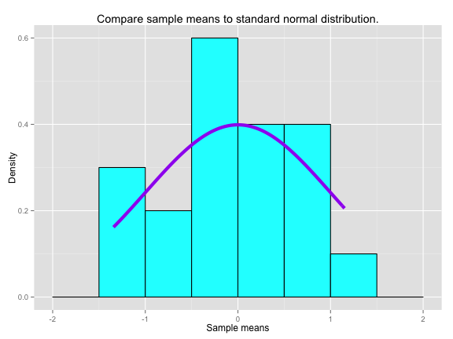
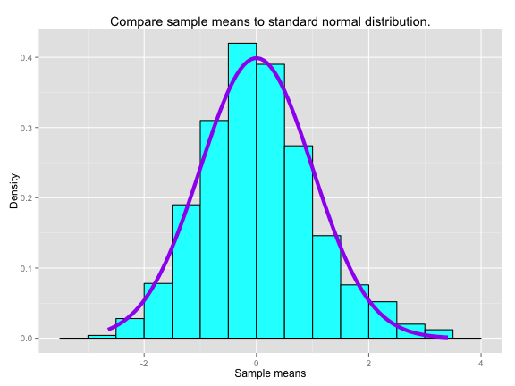

## INTRODUCTION

1. The distribution of sample means drawn from any distribution approach a normal distribution as the number of samples means is increased. 
2. To demonstrate this, samples means are drawn from multiple simulations of exponential distribution. The mean of the means is calculated.
3. The sample means are standardized and distribution is compared against a standard Normal distribution. 
4. The mean of means is compared with the population mean. 

## USER INTERFACE

* The application requires lambda and sample size parameters as inputs. These parameters of that of the exponential distribution.
* In addition, the number of simulations must be input. 
* In the next two slides, number of simulations is varied from 10 to 1000. The distribution of means for each case is shown in cyan and a standard normal distribution is shown in purple for comparison.

--- .class

## RESULT: 

1. The distribution of sample means does not match the Normal distribution.
2. Shown for Number of simulations = 20 (small number of simulation), lambda=0.5, sample size=40

 

--- .class

## RESULT: 
1. The distribution of sample means matches the Normal distribution
2. Shown for Number of simulations = 1000 (a large number of simulation), lambda=0.5, sample size=40

 

--- .class #id

## Conclusion

1. As the number of simulations increase, 
    + The means drawn from the exponential distribution follow a Normal distribution.
    + The percent difference between the sample and the population means decreases.
2. For small number of simulations, the percent difference between sample mean and population mean is 0.86 %
3. For large number of simulations, the percent difference between sample mean and population mean is -0.36 %

